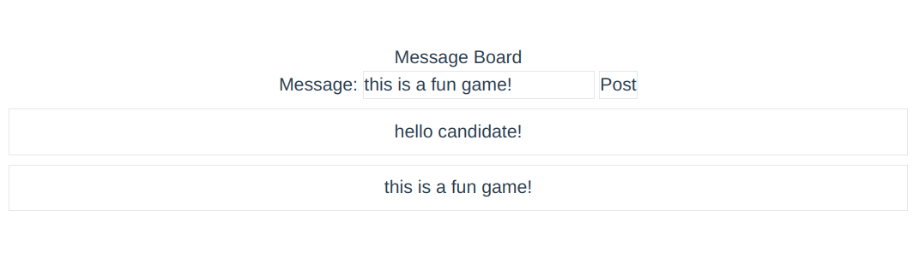

# Software Engineer III Take Home Assessment 

This is the repository for the System Initiatives Software Engineer III take-home assessment. It is designed to verify:

* That you have a proficiency with Rust
* That you have a familiarity with Typescript
* That you can architect a working system from a small design brief

We use a take-home assessment so that you can have your most productive environment at hand. Use whatever editor, operating
system, etc. you like. Google to your hearts content.

Spend no more than 4 hours on this assessment.

## What you'll be building

We want you to build a simple message board application. Users will input messages, click the "post" button, and see the
messages that have been left in a list below the input area. Something like this:

## How you'll be building it

We want you to build the frontend in a modern javascript framework. We use [Vue.js](http://vuejs.org), but if you are
more comfortable with [React](http://reactjs.org), [Angular](http://angular.js), or [Svelte](http://svelte.dev) - it's
no problem. Regardless of the framework you choose, we would like your code to use [Typescript](http://typescriptlang.org).

We use [Tailwind](http://tailwindcss.com) for CSS - but again, feel free to use whatever you like.

The backend should be written in Rust. We use [axum](https://github.com/tokio-rs/axum), but you can use any
async web framework for Rust that you prefer. Store the list of messages in memory. Please add tests for each
endpoint of your backend.

We want you to also include a README. In your README, include: 
* How to run your application
* How to run your tests
* Overview of your approach, including:
    * Insights into decisions you made
    * Strengths and weaknesses of your assessment
    * For ex: "I've never used axum before and am unsure if there is a better pattern to follow 
* What you would do if you had more time
* Any other helpful documentation you think would aid us in our review

When you've finished, create a repository on Github and send us the link. If you prefer to keep it private,
you can add `adamhjk`, `britmyerss`, `fnichol`, `vbustamante`, `nickgerace`, and `mahirl` as collaborators. 
